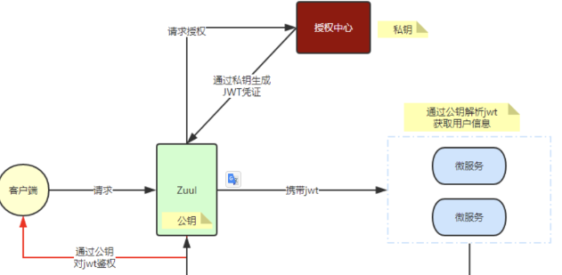

# 智慧校园二期接口设计方案

## 大纲
系统重新设定后将大致分为三部分：

### 一、云端WEB Server（微服务）
提供类似于当前版本的web服务，用户可以通过域名进行访问并开展业务。
技术栈： VUE
设计要求：
根据实际负载量，可将一个或多个部署在不通的服务上，由nginx server统一调度

### 二、云端业务微服务
按合理的业务模块，将现有系统的业务模块拆分成不同微服务，提供REST API供其他服务调用，处理业务逻辑
技术栈： Springboot + REST
设计要求：
各个业务模块可独立部署或多个部署，不依赖其他业务模块，统一由ngunx server统一调度

### 三、客户端WEB Server（特制非云端部署服务）
技术栈：Springboot + REST + VUE
设计要求：
独立部署在三方机房（入学校等单位），提供授权范围的业务功能服务

### 四、统一网关(JWT公钥拥有者)

每次鉴权都需要鉴权，如果把这个功能放在认证中心微服务，微服务之间间的网络请求频率过高，效率可能变差，鉴权中心的压力较大。
所有必要添加一个统一网关，主要作用就是鉴权（JWT）的有效性



#### 云端业务微服务介绍
基于大纲第二点，及方案设计的目的，将原来系统进行模块拆分成不通的微服务。

##### 统一认证微服务（JWT私钥拥有者）
提供用户登录授权，修改密码,用户信息修改等服务。
重点说明一下授权：
当确定一个用户为合法的用户后，返回加密的jwt token。
用户客户端在获取到token以后，存放在本地cookiee或storge.
调用其他接口时务必带上该token进行访问，以确认是否是一个合法的请求。
具体步骤如下：
1. 用户登录
2. 服务的认证，通过后根据secret生成token
3. 将生成的token返回给浏览器
4. 用户每次请求携带token
5. 服务端利用公钥解读jwt签名，判断签名有效后，从Payload中获取用户信息处理请求，返回响应结果

###### 登录接口
请求路径：/api/login
请求方式：POST
需要JWT Authorization Header: 否
请求Body:

```json
{
    "username":"admin",
    "password":"admin123",
    "code":"3",
    "uuid":"0eb0f5b1b92642a192b8603ada827cfb",
    "platformType":"01" // 在第三方部署时需要注意自动带上
}
```
返回结果：

```json
{
    "code":500, // 200 400 500 等状态码
    "serverTime":{
        "week":5,"
        month":"2",
        "hour":"16",
        "year":"2023",
        "now":"2023-02-10 16:37:26",
        "day":"10",
        "timestmp":1676018246572,
        "minute":"37",
        "second":"26"
    },
    "message":"验证码已失效",
    "env":{
            "enColor":"rgb(79, 3, 109)",
            "envName":"测试环境",
            "active":"dev"
    },
    "token": "TpWV_tAQMb6jqF0Y21ZhKrv5dk0abolZkIx3GXZDxc3WBxWFacbH6pa2Suw2KV0WiovrwIs_9TC8osUBdEzu6w" // JWT Token 失败时不返回
}
```

###### 获取用户信息接口
请求路径：/api/getInfo
请求方式：GET
请求params: 无
需要JWT Authorization Header: 是
返回结果：

```json
{
    "code": 200,
    "env": ".......",
    "serverTime": "......",
    "message": "......",
    "permissions":["*:*:*"],
    "roles":["admin"],
    "user": {}, // User Object
    "wxUser": null
}
```
###### 修改个人密码
请求路径：/api/system/user/profile/updatePwd
请求方式：PUT
需要JWT Authorization Header: 是
请求Body: 
```json
{
    "oldPassword": "123",
    "newPassword": "456"
}
```
返回结果：
```json
{
    "code": 200,
    "env": ".......",
    "serverTime": "......",
    "message": "......",
}
```

###### 修改个人信息
请求路径：/api/system/user/profile
请求方式：PUT
需要JWT Authorization Header: 是
请求Body: 
```json
{
    "nickName": "张晓峰",
    "phonenumber": "14333332221",
    "email":"xxxx@163.com"
}
```
返回结果：
```json
{
    "code": 200,
    "env": ".......",
    "serverTime": "......",
    "message": "......",
}
```

###### 修改个人头像
请求路径：/api/system/user/profile
请求方式：PUT
需要JWT Authorization Header: 是
请求Form: 
```form
avatarfile: 文件内容
```
返回结果：
```json
{
    "code": 200,
    "env": ".......",
    "serverTime": "......",
    "message": "......",
    "imgUrl": "IMG URL 地址"
}
```


##### 运维管理微服务
##### 教务管理微服务
##### 生产管理微服务
##### 经销存微服务
##### AI后期微服务
##### 数据中心微服务
##### AI监控微服务

